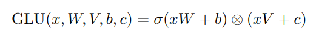

# GLU Variants
Author: Zheling Zhang
Email: zheling.zhang@vanderbilt.edu

## Introdcution
Transformers have become a dominant architecture in the field of natural language processing. However, their capacity for modeling complex dependencies can be limited by the standard feed-forward networks used within. The introduction of GLU variants into the feed-forward layers offers a novel approach to enhancing the model's representational power.

## Paper Overview
The core problem addressed in this paper is the quest for architectural improvements that can lead to better model performance without significatly increasing computational cost or complexity. The approach taken by the author involves integrating GLUs (Gated Linear Units) variants into the transformer architechture. GLUs are a type of neural network component that controls the flow of information through the network by applying a gating mechanism to linear units. This gating mechanism allows the model to learn which parts of the information to pass through and which to block, potentially leading to more efficient learning process.

                                          GLU(x, W, V, b, c) = σ(xW + b) ⊗ (xV + c)

