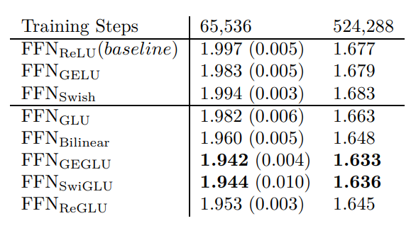

# GLU Variants
Author: Zheling Zhang

Email: zheling.zhang@vanderbilt.edu

## Introdcution
Transformers have become a dominant architecture in the field of natural language processing. However, their capacity for modeling complex dependencies can be limited by the standard feed-forward networks used within. The introduction of GLU variants into the feed-forward layers offers a novel approach to enhancing the model's representational power.

## Paper Overview
The core problem addressed in this paper is the quest for architectural improvements that can lead to better model performance without significatly increasing computational cost or complexity. The approach taken by the author involves integrating GLUs (Gated Linear Units) variants into the transformer architechture. 

## Overview of GLUs and Variants

  
What are GLUs (Gated Linear Units)?

  
GLUs are a type of neural network component that controls the flow of information through the network by applying a gating mechanism to linear units. This gating mechanism allows the model to learn which parts of the information to pass through and which to block, potentially leading to more efficient learning process.

  
 

The GLU Variants utilize the similar machanism to control the flow of information with different activation function.

**GLU**:
$$\text{GLU}(x, W, V, b, c) = \sigma(xW + b) \otimes (xV + c)$$

**Bilinear**:
$$\text{Bilinear}(x, W, V, b, c) = (xW + b) \otimes (xV + c)$$

**ReGLU**:
$$\text{ReGLU}(x, W, V, b, c) = \max(0, xW + b) \otimes (xV + c)$$

**GEGLU**:
$$\text{GEGLU}(x, W, V, b, c) = \text{GELU}(xW + b) \otimes (xV + c)$$

**SwiGLU**:
$$\text{SwiGLU}(x, W, V, b, c, \beta) = \text{Swish}_\beta(xW + b) \otimes (xV + c)$$

The additional variations on the transformer feed-forward network layer which use GLU or one of its variants in place of the first linear transformation and the activation function. The bias term is ommited in this paper.

**FFN_GLU**:
$$\text{FFNGLU}(x, W, V, W_2) = (\sigma(xW) \otimes xV)W_2$$

**FFN_Bilinear**:
$$\text{FFNBilinear}(x, W, V, W_2) = (xW \otimes xV)W_2$$

**FFN_ReGLU**:
$$\text{FFNReGLU}(x, W, V, W_2) = (\max(0, xW) \otimes xV)W_2$$

**FFN_GEGLU**:
$$\text{FFNGEGLU}(x, W, V, W_2) = (\text{GELU}(xW) \otimes xV)W_2$$

**FFN_SwiGLU**:
$$\text{FFNSwiGLU}(x, W, V, W_2) = (\text{Swish}_1(xW) \otimes xV)W_2$$

## Perplexity Result

## Fine-tuning

fully-trained models undergo a fine-tuning process on a meticulously constructed dataset amalgamating the Stanford Question-Answering Dataset (SQuAD) and all tasks encompassed within the GLUE and SuperGLUE benchmarks, ensuring a comprehensive exposure to a spectrum of natural language understanding challenges. This fine-tuning regimen, consisting of 131,072 steps employing a learning rate of 10^-3, is meticulously designed to refine the model's performance. Each training step processes input sequences aggregating approximately 65,536 tokens, a strategic choice aimed at optimizing the model's contextual learning capabilities. Adhering to practices established by Raffel et al., 2019, a dropout rate of 0.1 is applied to various components including layer outputs, feed-forward hidden layers, and attention weights, to mitigate overfitting risks by promoting the learning of more generalized representations. Notably, the embedding matrices remain unaltered during the fine-tuning phase, a decision that underscores a focus on enhancing the model's higher-level understanding without modifying the foundational token representations acquired during the pre-training phase. This holistic approach to fine-tuning is indicative of a rigorous attempt to bolster the model's adeptness across a diverse array of language understanding tasks, underlining the depth and precision of the optimization strategies employed.

## Pratical Benefits

The conclusion statement from the paper suggests that the GLU variants, when integrated into Transformer models, yield improved performance on various language understanding tasks. The practical applications of these findings are quite extensive, particularly in the field of Natural Language Processing (NLP), which involves teaching machines to understand, interpret, and generate human language. Here are some practical usages of such improvements:

**Sentiment Analysis**

Businesses and organizations can utilize these models to better gauge public sentiment from social media posts, reviews, and customer feedback, allowing for more responsive and targeted services.

**Question Answering Systems** 

Improved language models can lead to more accurate and relevant answers in AI-based customer service bots, virtual assistants, and information retrieval systems.

**Speech Recognition**

Incorporating these models into speech-to-text applications can result in more accurate transcription, which is beneficial for accessibility technology, legal transcriptions, and more.

## Citation

Shazeer, N. (2020b, February 12). GLU variants improve transformer. arXiv.org. https://arxiv.org/abs/2002.05202

## Useful links
Annotated Paper Implemenatation Notebook: https://nn.labml.ai/transformers/glu_variants/simple.html

Original code base: https://arxiv.org/pdf/1910.10683.pdf

